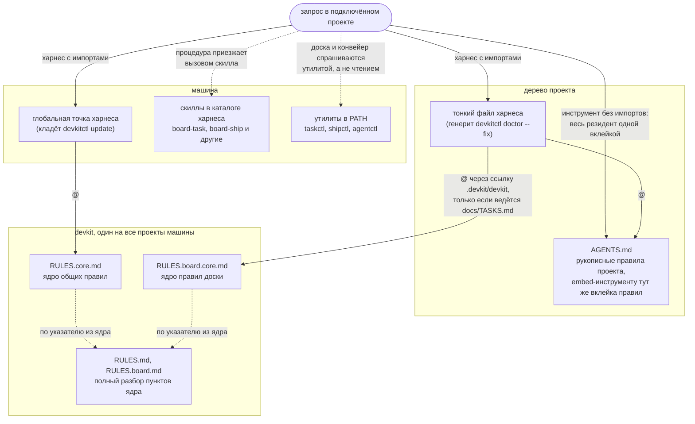

# devkit: общие правила и инструменты

Один репозиторий на все проекты: правила работы с ассистентом, система
приоритизации задач и инструменты доски. Ставится рядом с проектами одной
строкой, тулчейна для этого не нужно, бинари утилит едут готовыми из релиза:

```bash
git clone https://github.com/dronrider/devkit.git ~/projects/devkit && python3 ~/projects/devkit/tools/devkitctl/devkitctl.py update --pin
```

Дальше обновление это `devkitctl update`, разбор в разделе «Версии и доставка»
ниже, порядок подключения проекта в [CONNECT.md](CONNECT.md).

Рукописный файл правил в проекте один, `AGENTS.md`: там проектные особенности
и ссылка на devkit. Файлы под конкретный инструмент из него генерятся, у
Claude Code это тонкий `CLAUDE.md` с импортами:

```markdown
<!-- devkit:generated depth=core body=91b52d79f446 -->
@AGENTS.md
@.devkit/devkit/RULES.board.core.md
```

Импортируется ядро правил, а не весь их текст: резидентно только то, что нужно
в любой сессии, остальное читается по надобности и по указателю. Ядро общих
правил тонкий файл не зовёт вовсе, его везёт глобальная точка машины, поэтому
в примере выше остаётся ядро доски. Сколько текста доедет до инструмента,
решает его профиль, разбор в
[tools/devkitctl/README.md](tools/devkitctl/README.md).

Генерит их `devkitctl doctor --fix`, он же следит, чтобы они не протухли и
чтобы правленое руками не пропало молча. Зовутся правила через ссылку
`.devkit/devkit` внутри проекта: импорт наружу клиент не разворачивает и молчит
об этом, а ведёт ссылка в соседнюю директорию, поэтому devkit должен лежать
соседом проекта. Если файла нет, агент
по строке-подсказке в `AGENTS.md` клонирует devkit сам. Инструменту, который
импортов не понимает (Codex и подобные), тот же генератор вклеивает текст
правил прямо в `AGENTS.md` между маркерами `devkit:rules`, и копия эта в
дереве проекта одна.

Целиком дерево промтов на живом запросе выглядит так: сплошные стрелки это
резидентная часть, которую харнес собирает на старте сессии и держит в
контексте каждого запроса, пунктирные это то, что приезжает по надобности.



Дерево devkit на схеме не копируется в проекты: его ставят один раз на
машину, соседом проектов, и каждый подключённый проект зовёт это одно дерево
через ссылку `.devkit/devkit`. Поэтому обновление `devkitctl update` видят
все проекты разом, а копий правил в их деревьях нет.

Имена за узлами схемы это не устройство, а подстановки из профиля харнеса
(`kit/harness/*.toml`, включённые перечислены в `~/.devkit/harness.local`):
профиль называет глобальную точку (`global_file`), тонкий файл (`file`) и
каталог скиллов (`dir`). У Claude Code это `~/.claude/CLAUDE.md`, `CLAUDE.md`
и `~/.claude/skills`, у glm-code те же роли под своими путями, а инструмент
без импортов обходится вовсе без тонких файлов, ему та же резидентная часть
вклеивается в `AGENTS.md`. Ядро общих правил в тонком файле проекта не
повторяется намеренно: его уже привезла глобальная точка, и второй импорт
положил бы тот же текст в контекст дважды.

## Состав

- `docs/map.md` - карта проекта уровня компонентов и индекс решений из LLD-документов.
  Генерируется `devkitctl map` из кода и доки, плоские строки «путь: описание»,
  сортировка по пути. Вторым разделом идёт индекс решений: заголовки «Решение N» из
  `docs/lld/*.md` (строки «DK-XXX.N текст», сортировка по документу и номеру).
  Карта доставляется в контекст импортом `@docs/map.md` из тонкого файла харнеса,
  когда файл существует. Свежесть держит doctor: три находки (нет файла при живых
  компонентах, хеш разошёлся с телом, тело разошлось с деревом), все чинятся
  `doctor --fix` перегенерацией. Детали в `docs/lld/DK-194-project-map.md`.
- `docs/workflow.md` - ручная карта переходов работы от идеи до архива: узлы
  это состояния работы, рёбра это плоские строки «из -> в: кто делает»
  скиллом или командой. Пишется руками, смысловые переходы из текстов не
  выводятся. Полноту держит doctor: каждый скилл, каждый статус доски и все
  пять рубежей обязаны быть упомянуты. Детали в `docs/lld/DK-400-slot-and-parking.md`,
  решение 8.
- `RULES.core.md` - резидентное ядро правил: роль, тесты, git, чтение
  контекста, стиль кода и текстов. Это тот текст, который лежит в контексте
  любой сессии, и потому он короткий.
- `RULES.md` - полный текст с разбором каждого пункта ядра: пирамида тестов и
  regcheck, фича до пользователя, документация изменений, локальные дополнения.
  Читается по надобности, а не постоянно.
- `RULES.board.core.md` и `RULES.board.md` - та же пара для проектов с доской
  `docs/TASKS.md`: ядро (доску правит taskctl, ID задачи в коммите, доска
  пушится сразу, чувствительное мимо доски) и полный текст про ветки, ревью и
  деплой, трекинг задач. Подключается вторым импортом только там, где доска
  ведётся, и не ест контекст остальных проектов.
- `RANKING.md` - система приоритизации: Ranking 1..100 из пяти слагаемых,
  раскладка в приоритеты P0..P3.
- `TASKFORM.md` - форма черновика и файла задачи: заголовок первой строкой,
  подразделы черновика по SCQA, разделы файла задачи по порядку и то, какие из
  них ведёт машина и какой утилитой; как писать черновик, в скилле
  `board-draft`.
- `tools/taskctl/` - Go-утилита канбан-доски `docs/TASKS.md`
  (init/add/move/close/sort/lint/id), см. [tools/taskctl/README.md](tools/taskctl/README.md).
- `tools/shipctl/` - Go-утилита слияния и отката задач по правилам доски
  (status/start/merge/ship/revert); заводит worktree на задачу, чтобы
  параллельные сессии не толкались в одном рабочем дереве, команду выката
  берёт из гитигнорнутого `.devkit/deploy.local`,
  см. [tools/shipctl/README.md](tools/shipctl/README.md).
- `tools/agentctl/` - Go-утилита выбора исполнителя под задачу (pick): модель и
  reasoning effort по типу, цене и неопределённости с доски, применяется
  делегированием субагенту, см. [tools/agentctl/README.md](tools/agentctl/README.md).
- `tools/trackctl/` - Go-утилита корп-контура: всё, что говорит с трекером компании
  (status/issue/take/submit/sync), собрано в ней, а taskctl остаётся механикой
  доски и в сеть не ходит. Оценка и ворклоги уезжают командами границ: эстимейт
  считается из цены задачи, время из фактов работы, а sync тянет чужие переходы
  тикетов на доску. Трекер прибит контрактом адаптера (в сборке живёт `jira`,
  REST API v3), статусы компании
  укладываются в секции доски таблицей машинного контура
  `~/.devkit/tracker/<имя>.local`, см. [tools/trackctl/README.md](tools/trackctl/README.md).
- `tools/dashboard/` - Go-сервер веб-дашборда агентской разработки: доска и
  текущие работы проектов с телефона и ноутбука, статика вшита в бинарь, вход
  по своему токену с подписанной кукой. Своей базы нет, доску сервер берёт
  подпроцессом `taskctl list --json`, а процесс держит launchd-агент, который
  кладёт `devkitctl doctor --fix`,
  см. [tools/dashboard/README.md](tools/dashboard/README.md).
- `kit/harness/` - профили инструментов, в которых живёт сессия агента
  (`claude-code.toml`, `glm-code.toml` для второй подписки и дальше по одному на
  инструмент): что инструмент умеет
  по пяти осям (детект, правила, делегирование, хуки, квота). Читают профили
  agentctl и devkitctl, разбор в [tools/agentctl/README.md](tools/agentctl/README.md).
- `kit/agents/` - определения субагентов, по одному на уровень effort из маппинга
  agentctl и на роль (`exec-*` исполняют задачу, `review-*` ревьюят дифф);
  раскладывает их `devkitctl doctor --fix` по каталогу `[delegate] agents_dir`
  каждого включённого харнеса.
- `kit/skills/` - процедуры, общие всем проектам, по директории с `SKILL.md` на
  каждую: `board-task` ведёт задачу доски от строки до закрытия, `board-ship`
  двигает её код (ветка, ревью, слияние, выкат, откат), `review` ревьюит
  правку с любого входа (задача доски, MR, дифф ветки) по уровням
  тщательности и трём ярусам замечаний, `test-standard` держит
  стандарт тестов и доводку правки до пользователя, `board-batch` ведёт пачку
  задач доски от отбора кандидатов до выката и проверки, `board-draft` учит
  писать черновик (заголовок-исход, ситуация, осложнение, вопрос, гипотеза),
  `board-groom` разбирает
  черновики `taskctl draft` до одного из четырёх исходов (строка Backlog,
  приписка к стоящей строке, пометка отложенного, удаление протухшего),
  `board-team` держит захват задачи и разбор столкновений, когда по одной доске
  идут несколько рук, `goal-start` ставит цель (диалог, бюджет, файл цели),
  `goal-cut` режет цель на задачи (состав, список кандидатов пробной нарезки,
  сверка оценки с остатком бюджета), `goal-loop` ведёт её витки над обычным
  конвейером, `live-core` правит сам devkit по ходу цели, когда его недостаток
  мешает витку, `proofread` правит форму прозы агентов в долгоживущих текстах
  по типологии DK-173, не трогая фактов, команд и терминов словаря,
  `prose` держит корпус эталонов живой прозы (четыре жанра, словарь
  пользователя, сборщик реплик из журналов сессий) и кладёт в контекст письма
  горячий список из пяти примет и случайный набор фрагментов; зовут его
  оформление черновика, файл задачи, решение LLD и правка README,
  `prompt-test` проверяет правку самих промптов прогоном стенда `obeycheck`. Первые три
  это процедурная часть правил: резидентно только ядро, а шаги приезжают по вызову
  скилла. Копий в проектах нет, на машину их кладёт тот же `devkitctl doctor
  --fix`, только по каталогам `[skills] dir` включённых харнесов. Витки цели без
  человека поднимает оболочка `kit/skills/goal-loop/goal-run.py`: на машину она
  не уезжает и
  зовётся путём из чекаута, как `hooks/notify.py`.
- `tools/regcheck/` - Go-утилита, проверяющая, что регрессионный тест краснеет на
  старом коде, см. [tools/regcheck/README.md](tools/regcheck/README.md).
- `tools/obeycheck/` - Go-утилита рядом с regcheck: стенд послушания, который гоняет
  сценарии на двух раскладках правил и показывает таблицей, где послушание
  просело без текста правила в контексте. Каждый прогон живёт во временном HOME
  и синтетическом проекте, живая машина в нём не участвует,
  см. [tools/obeycheck/README.md](tools/obeycheck/README.md).
- `hooks/` - хуки харнеса и git. Проверки текстов (запрещённые символы, индекс
  памяти, чувствительное в доске) стоят двумя рубежами: `pre-commit` и
  `commit-msg` в git, PostToolUse в Claude Code. Рядом работа, привязанная к
  событиям сессии: `notify.py` уведомляет громко о том, что сессия ждёт
  действия или закончила ход, и фоново о том, что субагент отработал,
  `agent-watch.py` говорит той же вестью внутрь сессии, чтобы отчёт фонового
  субагента не потерялся по дороге, `quota-refresh.sh` освежает снимок квоты на
  старте сессии, см. [hooks/README.md](hooks/README.md).
- `tools/devkitctl/` - подключение проекта и диагностика обвязки (new/corp/doctor), а
  вместе с ними вес резидента: сколько текста devkit едет в каждый запрос
  сессии, считает и меряет живым прогоном `weigh`. Куда уходит объём целой
  сессии и не переписывался ли префикс по ходу, разбирает `stats --context` по
  журналам сессий харнеса, см. [tools/devkitctl/README.md](tools/devkitctl/README.md).
- `kit/templates/AGENTS.project.md` - заготовка проектного `AGENTS.md`: подсказка
  клонирования devkit, объявление доски или трекера, место под описание
  проекта.

Установка Go-утилит в PATH: все они едут готовыми бинарями в релизе, и ставит
их одна команда, без тулчейна и по имени каждой утилиты отдельно ходить не
надо.

```bash
python3 ~/projects/devkit/tools/devkitctl/devkitctl.py update
```

Она же обновляет: переводит клон на новейший релизный тег и меняет бинари
вместе с ним, разбор в разделе «Версии и доставка». Собрать из исходников
(машина разработчика devkit) это `devkitctl build`.

Раскладку машинного контура (бинари утилит, определения субагентов, скиллы,
права сессии без человека в `permissions.allow`, tmux и снимок квоты; всё это по
разу на каждый включённый харнес, каждому по путям его профиля)
проверяет `devkitctl doctor`, а
однозначное из этого он же и доводит с `--fix`, включая пакеты, которые ставит
пакетный менеджер машины (`tmux`, `terminal-notifier`).

Порядок подключения на оба сценария, обычный проект и корп-контур, собран в
[CONNECT.md](CONNECT.md): команды подряд, по строке пояснения на шаг. Здесь
только чем они отличаются.

Новый проект подключается одной командой (шаблон, доска, git-хуки):

```bash
python3 ~/projects/devkit/tools/devkitctl/devkitctl.py new --prefix XX
```

Проект корп-контура подключается своей командой:

```bash
python3 ~/projects/devkit/tools/devkitctl/devkitctl.py corp --prefix XX --contour <контур> --key ABC
```

Она заводит боковую директорию `../<проект>-local` с доской и своим
git-репозиторием, а в клоне оставляет обвязку: редирект `devkit.local`, тонкий
файл контекста харнеса под строкой `.git/info/exclude` и обёртки хуков поверх
чужих хуков проекта. В чужой репозиторий тогда не уезжает ничего нашего.
Прогон повторяемый, и он же восстанавливает обвязку после переклонирования,
разбор в [tools/devkitctl/README.md](tools/devkitctl/README.md).

Обвязка существующего проекта проверяется `devkitctl.py doctor`. Ручной путь тот
же, что делает утилита: копия шаблона в корень как `AGENTS.md`, доска через
`taskctl init --prefix XX` (если нет внешнего трекера), хуки по
[hooks/README.md](hooks/README.md), файлы правил под харнесы через
`doctor --fix`. Проект, подключённый до того, как файлы правил стали
генериться, переезжает двумя шагами: `git mv CLAUDE.md AGENTS.md` (строки
импортов оттуда убрать, их выпишет генератор), потом `doctor --fix`. Сам
`doctor` про этот переезд и подсказывает, но делать его автоматически не
берётся: в живых `CLAUDE.md` бывают локальные вещи вроде импорта
корпоративных правил.

## Раскладка

Место новому файлу выбирается правилом, а не на глаз. Каталогов верхнего
уровня пять, и у каждого свой ответ на вопрос, кто до него доходит. Четыре из
них (`tools/`, `kit/`, `hooks/`, `docs/`) зовёт кто-то снаружи: человек,
агентская сессия, git, читатель. До пятого, `internal/`, доходят сами
инструменты: это общий go-модуль каркаса, который утилиты из `tools/`
импортируют, а не запускают по имени.

- `tools/` - инструменты, по директории на каждый, имя директории это имя
  команды: внутри исходники одного инструмента, его тесты, `testdata/` и
  `README.md`, и язык у него один.
- `internal/` - общий go-модуль каркаса утилит (заведён DK-237): его
  импортируют утилиты из `tools/`, а не зовут по имени, отсюда go-пакеты вроде
  `frame`. Язык один, go; это library, а не команда, поэтому под правило «имя
  директории это имя команды» она не подошла.
- `kit/` - материал агентской сессии: определения субагентов (`kit/agents/`),
  скиллы (`kit/skills/`), профили харнесов (`kit/harness/`), заготовка проектного
  `AGENTS.md` (`kit/templates/`). Это то, что devkit раскладывает на машину и в
  проект или читает как данные; кода тут нет, кроме трёх мест по контракту:
  оболочка скилла лежит рядом со своим `SKILL.md` (ровно там, не подкаталогом
  глубже), сменный съёмщик остатка квоты в `kit/harness/snap/<харнес>.sh`,
  откуда его зовёт `agentctl`, и самопроверка скиллов `check-skills.py` с её
  тестом в самом `kit/skills/`: инструмент проверяет каталог рядом с собой, и
  унести его в `tools/` значит развести с проверяемым.
- `hooks/` - точки входа git и харнеса. Каталог остаётся в корне, потому что
  на его путь смотрят `core.hooksPath` подключённых проектов, обёртки хуков
  корп-клонов и команды в `~/.claude/settings.json`, а чинятся эти ссылки
  только вызовом `doctor --fix` в каждом месте.
- `docs/` - доска, файлы задач и LLD. Кода инструментов тут нет, живут только
  одноразовые сценарии проверки задач.

В корне лежит текст, который читают на входе (`README.md`, `CONNECT.md`,
`AGENTS.md`, `CLAUDE.md`), правила (`RULES*.md`, `RANKING.md`, `ACCEPTANCE.md`,
`TASKFORM.md`)
и `.gitignore`.
Правила остаются в корне по той же причине, что и хуки: на `RULES.core.md`
ссылается глобальный `~/.claude/CLAUDE.md` и тонкий файл каждого подключённого
проекта. Исполняемых файлов в корне нет, и нового каталога верхнего уровня без
решения в LLD не заводится.

Сверх раскладки в корне живут два служебных каталога, `.github/` с описанием
CI и `.devkit/` с рабочей обвязкой выката: правила они не нарушают, потому что
формат им задаёт не devkit. Вместе с пятью каталогами раскладки и
корневыми файлами это и есть весь верхний уровень, и другой записи там быть не
должно.

Язык инструмента выбирается по тому, что должно работать до сборки.

- go - то, что ставится в PATH и зовётся по имени из любого проекта
  (`taskctl`, `shipctl`, `agentctl`, `trackctl`, `regcheck`, `obeycheck`,
  `dashboard`). Сборку и установку окупает только инструмент, которым
  пользуются снаружи devkit.
- python - то, что зовут путём из чекаута и что обязано работать на голой
  машине, где ещё ничего не собрано: хуки, подключение и диагностика
  (`devkitctl`), оболочки, тесты python-части. Тест лежит рядом с модулем и
  зовётся `<модуль>_test.py`, а дефис в имени модуля становится в имени теста
  подчёркиванием (`check-symbols.py` и `check_symbols_test.py`): файл, чьё имя
  не годится в имя модуля python, `discover` пропускает молча. Точку входа,
  которую зовут путём из чекаута и её имя названо в тексте скилла
  (`goal-run.py`), дефис не отпускает и там, но раз до неё `discover` всё
  равно не доходит, тест гонит её отдельным процессом, а не импортом.
- sh - тонкая обёртка вокруг одной команды и одноразовый сценарий проверки
  задачи в `docs/tasks/`.

Внешних зависимостей нет ни у go, ни у python: devkit ставится на голую машину
и работает в корп-контуре, где `pip install` бывает недоступен, поэтому разбор
TOML написан руками с обеих сторон.

Граница sh машинная, чтобы спор не шёл на глаз: файл перестаёт быть допустимым
на сотой строке или на первой своей функции, дальше это программа и ей место в
python. По этой границе на sh остаются точки входа git (`pre-commit`,
`commit-msg`, `pre-push`), хуки старта сессии `hooks/quota-refresh.sh` и
`hooks/board-catchup.sh` и фикстуры в `testdata/`, которые изображают чужую
программу. Правило языка не смотрит на три места:
`docs/tasks/` (сценарий пишется под один прогон и после закрытия задачи не
запускается), `testdata/` любой утилиты (там чужой код, включая фикстуру
синтетического проекта у `obeycheck`) и `kit/harness/snap/` (съёмщик квоты
пишется под чужой инструмент по своему контракту).

Общая фикстура разбора TOML (`kit/harness/testdata`) лежит рядом с форматом, а
не рядом с кодом: по ней сверяются оба разбора, go-шный и python-овый, и
растащить её по утилитам значит потерять сверку.

Нарушение ловит `devkitctl doctor`, он же отдельно и без машинной обвязки:

```sh
python3 tools/devkitctl/devkitctl.py doctor --layout
```

Находка называет файл и правило, тем же шагом она стоит в CI. Ходит проверка по
`git ls-files`, судит только про сам devkit и оставляет ревью смысловое:
оправдан ли go новому инструменту, остался ли короткий sh списком команд, верна
ли группа внутри `kit/`.

Решение с перечнем переездов и разбором отвергнутых вариантов в
[docs/lld/DK-139-repo-layout.md](docs/lld/DK-139-repo-layout.md); пятый каталог
раскладки, `internal/`, и почему каркас ушёл в общий модуль, а не в копии,
разобраны в [docs/lld/DK-237-shared-go-module.md](docs/lld/DK-237-shared-go-module.md).

## Версии и доставка

Готовые бинари едут релизами гитхаба: тег `vX.Y.Z` запускает сборку, к релизу
прикладываются четыре тарболла (`darwin`/`linux` на `amd64`/`arm64`) и
`SHA256SUMS`. Своего tap нет: brew кладёт в Cellar, а клон правил обязан
остаться на виду, и обновление разошлось бы на две команды с двумя разными
представлениями о том, какая версия стоит. Тег ставит человек, автоматика его
не двигает.

Что собирается и что ставится, выводится из дерева, а не из списка в коде:
каталоги `tools/*/` с `go.mod`. По правилу языка go тут это ровно то, что
стоит в PATH, поэтому список сборки, список установки и список проверки
`doctor` совпадают по построению, и новая утилита попадает во все три тем, что
появилась.

Версию сборка зашивает в бинарь (`-ldflags`), берётся она из git чекаута, из
которого идёт сборка. Печатают её все утилиты одинаково, первой строкой:

```
taskctl v0.2.0 (a1b2c3d4e5f6)
```

Версия репозитория правил это HEAD его основного чекаута, и правило сходимости
одно: бинарь собран из кода, который лежит в чекауте. Меряется это по коммитам,
а не по времени файла, и считается по коду утилиты, а не по HEAD: доска devkit
живёт в том же репозитории, и коммит «DK-000 в Check» уводил бы HEAD вперёд, не
меняя в бинаре ни байта. Отставший бинарь это находка `doctor`, потому что
бинари и правила составляют одну версию. Отсюда
два режима чекаута, и доктор их называет: на машине потребителя чекаут стоит на
теге (detached HEAD), и обновление двигает его на следующий тег вместе с
бинарями; на машине разработчика devkit чекаут стоит на ветке впереди
последнего тега, релиза под такой HEAD нет, и сходимость держит локальная
сборка `devkitctl build`.

Установка и обновление это одна команда, `devkitctl update`: она переводит
чекаут на новейший тег, ставит бинари этого тега и раскладывает машинный
контур. С ветки она чекаут молча не уводит: в основном чекауте ведётся доска и
работают ветки задач, поэтому там команда отказывается и называет обычный путь
(`git pull` и `doctor --fix`), а первая установка разрешает переход явным
ключом `--pin`. Клон репозитория установщик не делает, его делает человек
первой командой: путь клона это то, на что смотрит импорт правил в каждом
проекте.

На голой машине обе половины пишутся одной строкой, и это весь список команд
установки:

```bash
git clone https://github.com/dronrider/devkit.git ~/projects/devkit && python3 ~/projects/devkit/tools/devkitctl/devkitctl.py update --pin
```

Бутстрапа `curl | sh` за ней не стоит и не появится: он был бы второй точкой
входа с той же работой и выбирал бы путь клона молча, разбор в
[docs/lld/DK-149-binary-delivery.md](docs/lld/DK-149-binary-delivery.md).
Дальше обновление идёт голым `devkitctl update`. Порядок команд подключения
проекта в [CONNECT.md](CONNECT.md).

Каталог назначения выбирается так: `DEVKIT_BIN`, если задан, иначе первый из
`~/go/bin` и `~/.local/bin`, который уже стоит в PATH, иначе `~/.local/bin`.
Профиль оболочки devkit не правит, это единственный файл в списке раскладки,
который человек ведёт сам: каталог мимо PATH уезжает в «осталось сделать»
готовой строкой и держится находкой доктора, пока не появится в PATH.

Про вышедший релиз машине потребителя говорит `doctor`, `git pull` в
отвязанном чекауте не работает. Находок две: точная, сравнением тега чекаута с
новейшим тегом в клоне («стоит v0.2.0, вышел v0.3.0»), и косвенная, про давний
поход за тегами (mtime `FETCH_HEAD` старше двух недель). Спросить самому это
`devkitctl update --check`: он тянет только релизные теги и рассказывает, не
трогая ни чекаута, ни бинарей. Первая находка гаснет только от обновления, так
что узнать про релиз и забыть про него не выйдет.

Сам `devkitctl` остаётся на python, потому что обязан работать на машине, где
ещё ничего не собрано, а зовётся по имени наравне с бинарями: генератор кладёт
рядом с ними обёртку из трёх строк с путём до чекаута. Длинный путь остаётся
только в первой команде установки, до которой обёртки ещё нет.

Собирает и релиз, и машинный бинарь одна команда, `devkitctl build` (разбор в
[tools/devkitctl/README.md](tools/devkitctl/README.md)); по тегу её же гоняет
workflow `.github/workflows/release.yml`. Версию она берёт по релизным тегам
`v*`, а служебный тег `deployed`, который двигает `shipctl` на каждом выкате, в
счёт не идёт.

Сверяет версии `doctor`: спрашивает у каждого бинаря `--version` и сравнивает
зашитый коммит с HEAD основного чекаута, а рядом называет режим чекаута.
Расхождение он и чинит, тем, что на машине есть: на теге ставит бинари релиза,
иначе собирает. Разбор в [tools/devkitctl/README.md](tools/devkitctl/README.md).

Решение с разбором отвергнутых вариантов в
[docs/lld/DK-149-binary-delivery.md](docs/lld/DK-149-binary-delivery.md).

## Журнал запусков

Каждый инструмент дописывает строку о своём запуске (время, команда, код
выхода, поля через табуляцию) в гитигнорнутый `.devkit/log` проекта, если
директория `.devkit` заведена. Это статистика использования: по журналу
видно, какие команды реально гоняются, как часто падают и гоняется ли
regcheck на багфиксах (последнее подсказывает `shipctl merge`). Провал записи
работу инструментов не ломает.

Задачи по развитию самого devkit ведутся на его же доске `docs/TASKS.md`
(префикс DK), теми же правилами, что у проектов. Тесты всех инструментов
гоняет CI (GitHub Actions) на каждый push, локальный прогон целиком это
`python3 tools/devkitctl/parallel.py` из корня (раннер гонит компоненты
одновременно с потолком воркеров: go-утилиты остаются с `-count=1`, сюита
devkitctl уходит в свой раннер классов, первый провал валит прогон, вывод
провалившегося печатается целиком). По одному компонент зовётся руками: `go test ./...`
в директории каждой Go-утилиты, `python3 -m unittest discover -p '*_test.py'`
из `hooks/`, `kit/skills/` и каждого скилла со своими тестами
(`kit/skills/goal-loop/`, `kit/skills/prose/`), `python3 suite.py` из
`tools/devkitctl/` (раннер гонит классы отдельными процессами),
`python3 kit/skills/check-skills.py` и
`python3 tools/devkitctl/devkitctl.py doctor --layout` (раскладка). Ключ `test`
в гитигнорнутом `.devkit/deploy.local` зовёт раннер строкой
`export GOWORK=off; python3 tools/devkitctl/parallel.py`.
